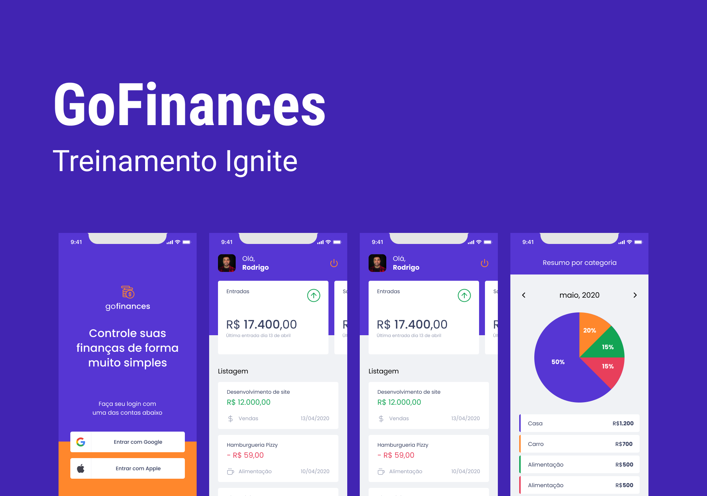

<h1 align="center">
  
</h1>

 

  

## ✨ Tecnologias

Esse projeto foi desenvolvido com as seguintes tecnologias:

- [React Native](https://reactnative.dev/)
- [Typescript](https://www.typescriptlang.org/)
- [Expo](https://expo.io/)
- [Styled-Components](https://styled-components.com/)
- [Reanimated](https://docs.swmansion.com/react-native-reanimated/)

## 💻 Projeto

Aplicativo para controle de finanças.
